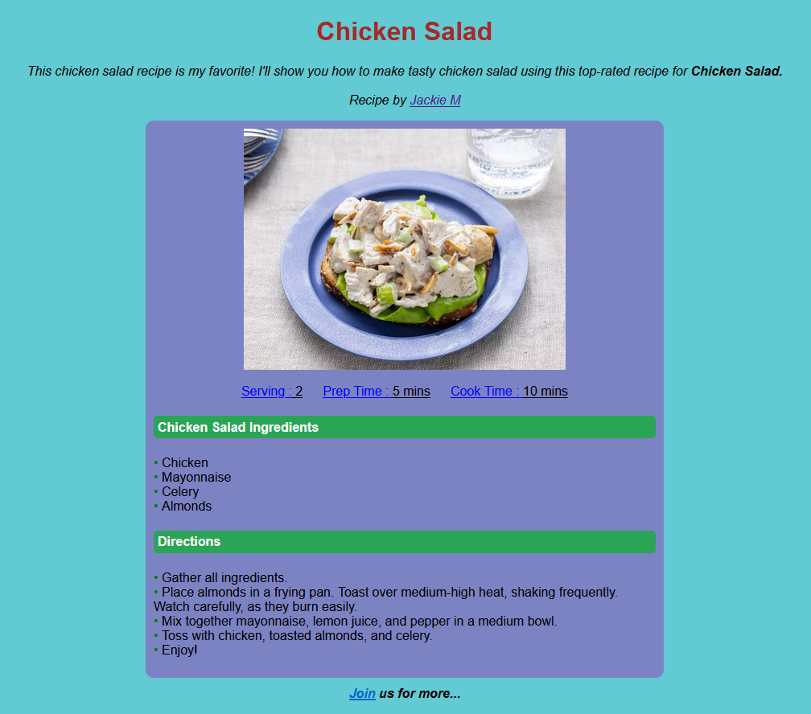

# Kodluyoruz - Chicken Salad Recipe

## 

This repo is created for [Kodluyoruz](https://kodluyoruz.org/) HTML Learning Homework - 3. It contains index.html, gitignore and README.md files.  

## The Link
https://okanbuyuktepe.github.io/chickensaladrecipe/

## Installation
Cloning the repo:
```bash
git clone https://github.com/okanbuyuktepe/chickensaladrecipe.git
```

## Usage
After cloning the project, the index.html file can be opened by any browser or you can use Visual Studio Code.

For Linux:

```linux
cd chickensaladrecipe
code .
```

## Contributing
Pull requests are accepted. Please open a topic in order to discuss the major changes.

## License
[MIT](https://choosealicense.com/licenses/mit/)
